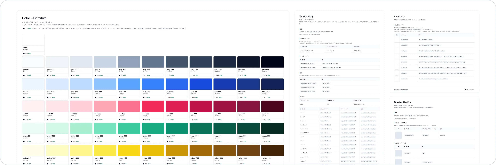

# design-system-sample
デザインシステム（スタイルガイド・コンポーネントライブラリ）の実装サンプルです。



## パッケージ
- [HTML版](./packages/html/)

## 関連ドキュメント
- [Figma](https://www.figma.com/file/jYvAjaxrZXhx57FNuDAv3Q?node-id=0-1&p=f&t=WB6sp1Iaw1BUbrTw-0&type=design&mode=design&fuid=976835577808071486)

## セットアップ
### 前提条件
- [最新のLTS版のNode.js](https://nodejs.org/ja/download)がインストールされていること

### リモートリポジトリからClone
GitHubに保存されたリポジトリをCloneしてください。
```shell
git clone git@github.com:d120145/design-system-sample.git
```

### pre-commitの有効化
コードフォーマットの自動化のためにpre-commitを使用しています。以下の手順で有効化してください。
```shell
git config core.hooksPath .githooks
```

```shell
cd .githooks
```

```shell
chmod +x pre-commit
```

### 依存関係をインストール
npmパッケージの依存関係をインストールします。
npm workspacesを使用しているため、ルートディレクトリで実行するとすべてのWorkspaceに対してインストールされます。
```shell
npm ci
```

## 開発用コマンド
### Tailwind CSS
#### Watch実行
```shell
npm run -w packages/html tailwindcss:watch
```

#### Build実行
```shell
npm run -w packages/html tailwind:build
```

### Prettier
#### Check実行
```shell
npm run -w packages/html prettier:check
```

#### Format実行
```shell
npm run -w packages/html prettier:format
```
