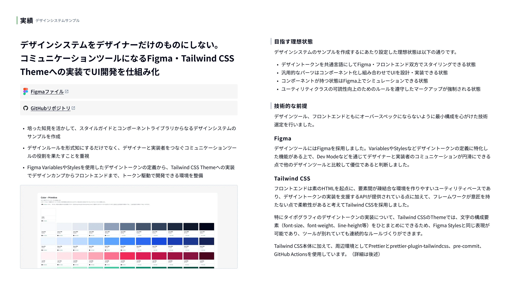
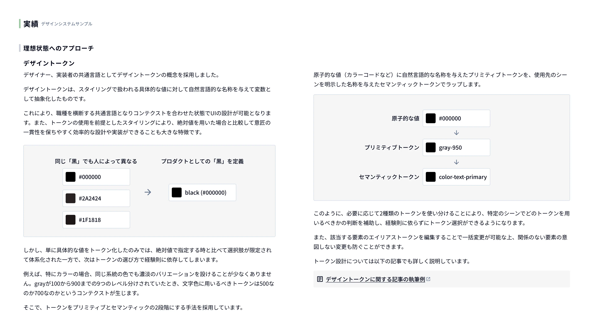
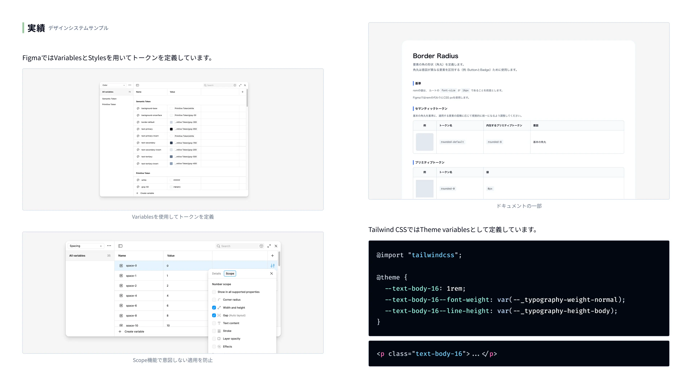
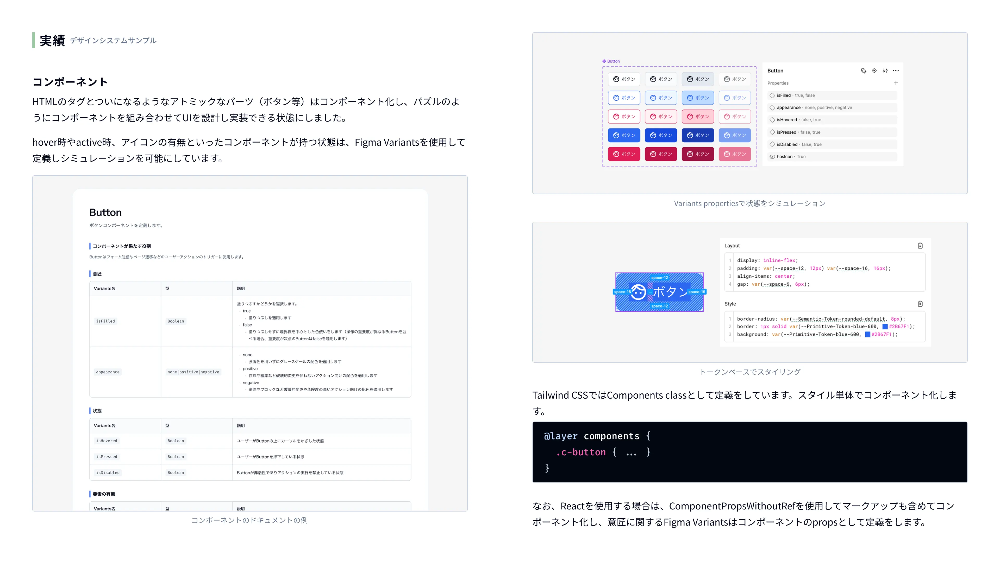
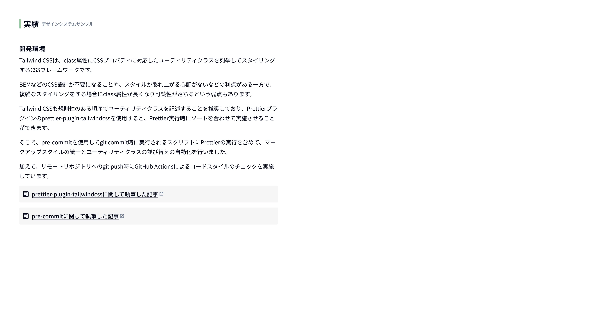

# design-system-sample（HTML版）

design-system-sampleのHTML版です。
純粋なHTMLをベースに、Tailwind CSSを使用してデザイントークンとコンポーネントを実装しています。

## コンセプト

- [Figmaファイル](https://www.figma.com/design/jYvAjaxrZXhx57FNuDAv3Q/design-system-sample?node-id=4006-1775&t=zGfBsyz0AaqGoA6m-0)
- [GitHubリポジトリ](https://github.com/d120145/design-system-sample)

- [デザイントークンに関する記事の執筆例](https://tech.excite.co.jp/entry/2024/12/04/082041)

- [prettier-plugin-tailwindcssに関して執筆した記事](https://tech.excite.co.jp/entry/2024/06/10/145429)
- [pre-commitに関して執筆した記事](https://tech.excite.co.jp/entry/2024/06/24/125911)
